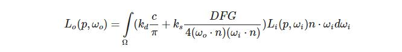
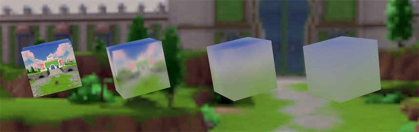
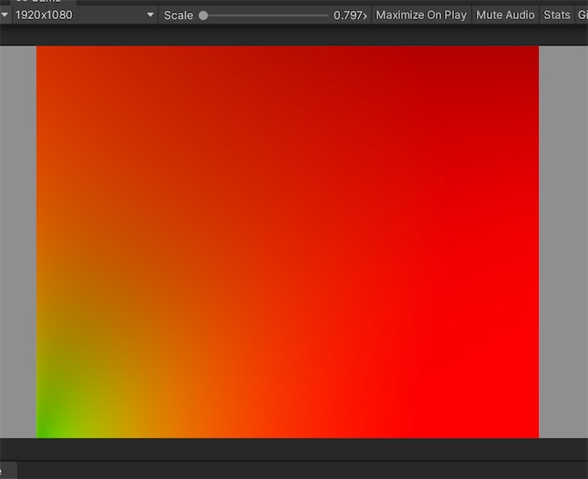
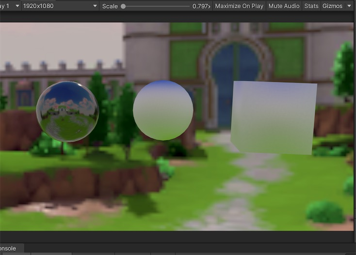
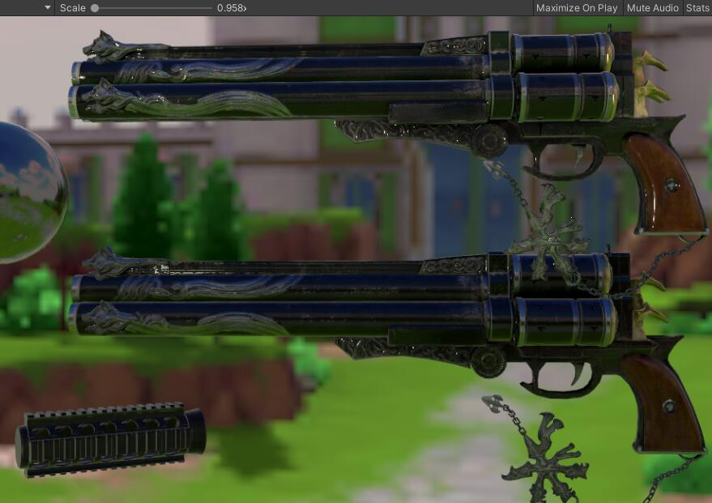

### PBR 渲染 

这里实现的方式基于 [LearnOpenGL][i1]的公式，主要是将 OpenGL(GLSL) 的实现方式转换成 unity 支持的 Shader。

   

### Scenes:

__1. Example_Filter__

生成不同粗糙 roughness 情况下的预滤波环境贴图

   

__2. Example_Lut__

 生成BRDF 积分贴图，lut 

   

__3. Example_Irradiance__

间接光-漫反射   辐照度图（cubemap）生成

  

__4. Example_PBR__

Unity 默认的 GI 生成的 PBR 效果 和 教程中的公式求得效果对比。

  

上图中， 上面的枪使用的Unity默认的GI管线得到的， 下面的枪使用的LearnOpenGL的方法渲染得到的结果。 项目中 PBR 模型来自于 [Artisaverb][i3]。

## 参考

* [Specular IBL Render in LearnOpenGL][i1]
* [ Epic Games 的分割求和近似法][i2]

[i1]:https://learnopengl-cn.github.io/07%20PBR/03%20IBL/02%20Specular%20IBL/
[i2]: https://blog.selfshadow.com/publications/s2013-shading-course/karis/s2013_pbs_epic_notes_v2.pdf
[i3]: http://artisaverb.info/PBT.html
